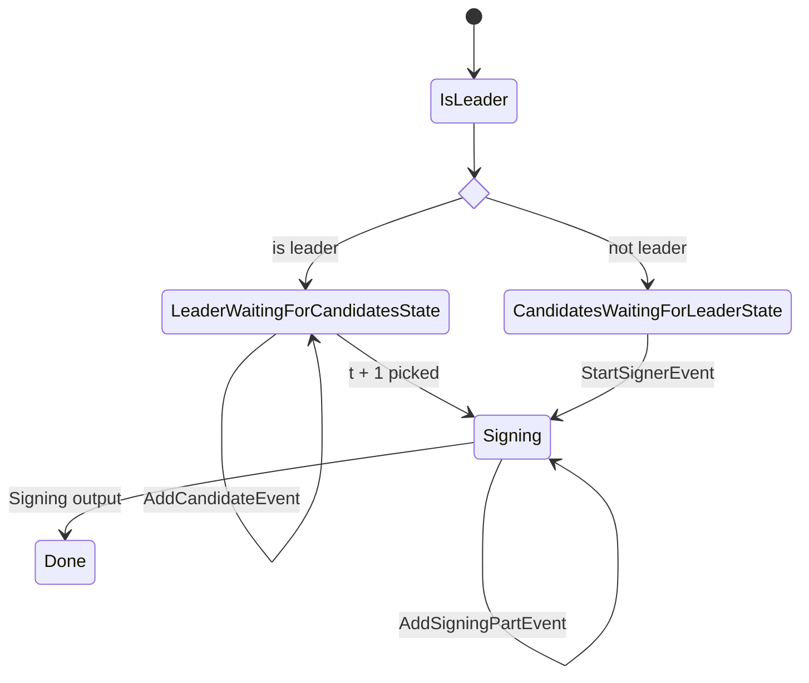

# States

## Per Signing Session State

States per signing session. There may be multiple sessions running in parallel.

### 1. PickLeader

1. All peers determine the leader
2. Send `JoinSessionMessage` to leader
3. Receive `SigningPartyStartMessage`
4. If in session, go to `Signing` State
5. If not in session, end state

### 2. Signing

1. Send and receive `SigningPartMessage` until signature output
2. Signature output go to `Broadcast` state
3. Send `SigningOutputMessage` to check all peers have the same signature
4. Go to `Broadcast`

### 3. Broadcast

1. Broadcast message to destination chain Kava / Ethereum.
