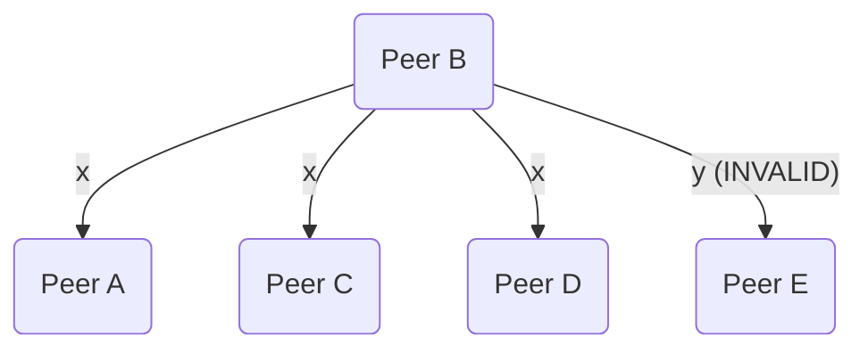

# Reliable Broadcast

The base layer of communication relies on reliable broadcast to ensure all peers
not only receive a message, but also that the message is the same as all other
peers.

This communication layer also supports reliable broadcast for a **subset** of
all peers to selectively send messages for signing rounds.

## P2P Communication

The reliable broadcast protocol uses [go-libp2p] to provide encrypted and
authenticated private peer to peer network. All peers will share a 256 bit
network secret and have a secp256k1 private and public key pair to authenticate
with each other and sign messages across the p2p network.

All peers will have a list of peer [multiaddresses][multiaddr] that encodes the
transport, protocol, and hash of the peer's public key. Any peers that are not
in the configured peer list will be rejected.

## Message

Each message contains the following data:

* Unique ID
* Peer ID list of participating peers (e.g. subset of all connected peers, or all of them)
* Payload, protobuf `Any`
* Initiating peer ID
* Created timestamp
* TTL in seconds

## Basic Algorithm

A simplified way of how the reliable broadcast works is as follows.

Peer A wants to broadcast x.

1. A sends x to all other peers in the message peer list.
2. Every other peer sends sha256(x) to all other peers in the message peer list
   including peer A.
3. Every peer verifies received hashes against it's own message and checks all
   other peer hashes are the same.
4. If any inconsistent values, abort. Otherwise, x is output, meaning peers can
   continue to do work with the value such as signing.

## Failure Cases

### Unresponsive Peer

A unresponsive peer would cause all other peers to not receive a message from
that peer. This would be a clear failure case for other peers as it fails the
basic requirement of receiving the same message from all other peers.

### Inconsistent Broadcaster

If the broadcasting peer sends 2 different messages to peers, all other peers
will invalidate the message as there would be inconsistencies in the
re-broadcasted values from other peers.

### Inconsistent Re-Broadcaster

In the case where a **re-broadcasting** peer sends 2 different messages, one
valid and one invalid, it becomes more complicated.

For example, if peer A broadcasts x, and a malicious or faulty peer B re-broadcasts:
* x to peers A, C and D
* y to peer E

Peer A, C, D would consider this as a valid message and output x as they
received x from all other peers, but peer E would not, resulting in an
inconsistent state across all peers.

This is not handled by the reliable broadcast layer as it is a relaxed reliable
broadcast protocol. Failure is handled in later steps (i.e. signing) where other
peers will fail to continue.

**Note:** Blaming the original peer that re-broadcasted the incorrect message 
message is to be implemented later (e.g. signing broadcast messages).

[go-libp2p]: https://github.com/libp2p/go-libp2p
[multiaddr]: https://docs.libp2p.io/concepts/addressing/
