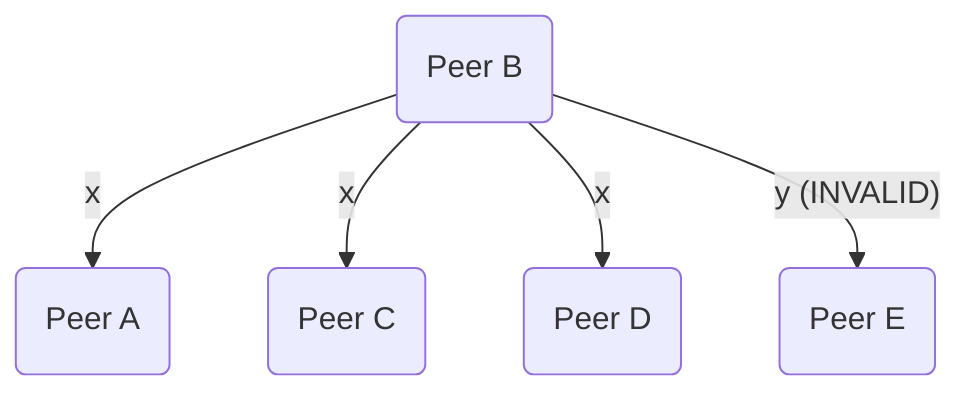

# Reliable Broadcast

The base layer of communication relies on reliable broadcast to ensure all peers
not only receive a message, but also that the message is the same as all other
peers.

This communication layer also supports reliable broadcast for a **subset** of
all peers to selectively send messages for signing rounds.

## Message

Each message contains the following data:

* Unique ID
* Peer ID list of participating peers (e.g. subset of all connected peers, or all of them)
* Payload, protobuf Any data
* Initiating peer ID
* Created timestamp to keep track expire time

## Basic Algorithm

A simplified way of how reliable broadcast works is as follows.

Peer A wants to broadcast x.

1. A sends x to all other peers in the message peer list.
2. Every other peer re-sends x to all other peers in the message peer list
   including peer A.
3. Every peer checks that they received the same values.
4. If any inconsistent values, abort. Otherwise, x is output.

## Failure Cases

### Unresponsive Peer

A unresponsive peer would cause all other peers to not receive a message from
that peer. This would be a clear failure case for other peers as it fails the
basic requirement of receiving the same message from all other peers.

### Inconsistent Peer

If the broadcasting peer sends 2 different messages to peers, all other peers
will invalidate the message as there would be inconsistencies in the
re-broadcasted values from other peers.

However, in the case where a **re-broadcasting** peer sends 2 different
messages, one valid and one invalid, it becomes more complicated.

For example, if peer A broadcasts x, and a malicious or faulty peer B re-broadcasts:
* x to peers A, C and D
* y to peer E

Peer A, C, D would consider this as a valid message and output x as they
received x from all other peers, but peer E would not, resulting in an
inconsistent state across all peers.

TODO: How do we handle this case? Do a second round of re-broadcasting to confirm
the output message from each peer is the same?
