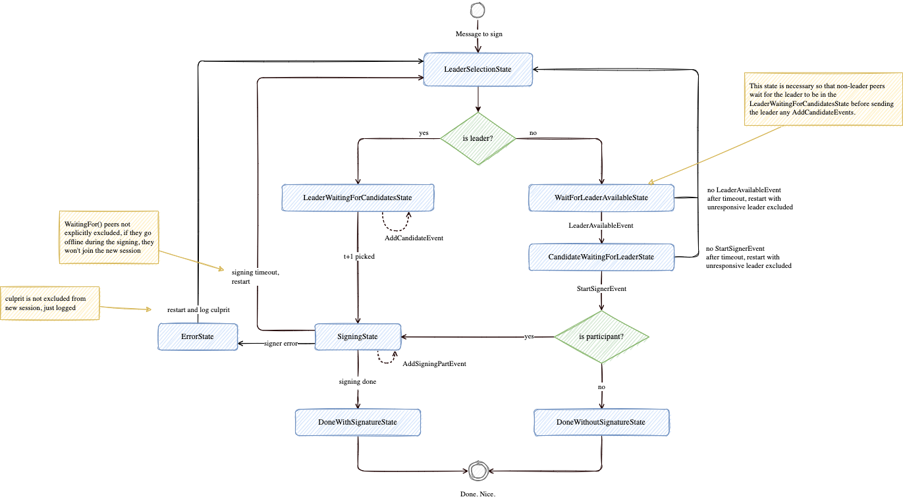

# Signing

The Kava bridge will use an ECDSA threshold signature scheme with threshold `t`
and `n` peers, where `t <= n`. The scheme is secure against a dishonest majority
up to `t = n - 1` without compromising the integrity of the private key. In
other words, `t+1` out of `n` peers are required to sign.

No more than `t+1` peers should participate in a signing party for optimal
usage.

## Session State

<p align="center">
  
</p>

## Transaction Monitoring

Relayer monitors transactions on both Ethereum and Kava blockchains for bridge
transactions. Bridge transactions on both Ethereum and Kava have a unique
incrementing sequence used to determine the transaction order.

## Leader

A leader is used for determining which peers participate in a signing party and
coordinating retries when peers may go offline.

When a bridge transaction is found on either Ethereum or Kava, the transaction
hash is used to deterministically pick a random leader.

```go
leaderIndex := txHash % numOfPeers
```

The peers are sorted by their peer ID and the leader index is used to pick the
leader.

```go
sort.Slice(peerIDs, func(i, j int) bool {
    return peerIDs[j] < peerIDs[i]
})

leaderPeerID := peerIDs[leaderIndex]
```

### Leader Failure

If the leader is unresponsive within a certain timeout, a new leader is picked
by simply incrementing the leader number, wrapping back to 0 if necessary.

## Party Initialization

When a leader is picked, it broadcasts a party initialization message. When
other peers receive this message, t + 1 peers must respond to join the party.
Any additional peers are rejected and are not needed for the party. The party
peer are picked by the first peers that respond to the initialization message.

This not only includes only the required number of peers to sign a message, but
also handles certain cases such as a peer that is not responding.

For example, if 4 of 5 are required to sign a message, the first 3 peers to
respond to the leader will be selected to join the party (1 leader + 3
additional peers) while the last one will be excluded.

### Leader Validation

Peers must validate the party initialization message originated from the chosen
leader peer ID. As all peers pick the leader deterministically, they can reject
any party initialization message broadcasted from a peer that does **not** match
the picked leader ID and log for misbehaving or malfunctioning node.

## Party Pooper

If a peer stops responding during a party signing session, a new party is formed
without the unresponsive peer. In order to determine when a peer is
unresponsive, signing rounds have a timeout in the reliable broadcast
communication layer. When this timeout is reached without responses from all
party peers, the leader will broadcast a message to all participating peers to
stop the party and create a new one excluding the unresponsive node.

## Party Timeouts

Each signing session has a duration that it must finish by or it will be restarted
with the peers that are pending (`party.WaitingFor()`). This can be a relatively
short duration like 20 seconds.

When a signing session stalls, it is due to one or more peers not sending their
party messages to others. When the timeout is reached, each party sends the
leader the other parties they are waiting on. The leader then can figure out
which peer is not responding.

### Cases

1. Peer that gone offline.
   1. If reported peer doesn't send the leader it's WaitingFor list, then the
      signing session is restarted with the peer excluded.
2. Malicious peer falsely reporting an unresponsive peer.
    * If reported peer responds to the leader then its a fake report ? idk
    * ???


## Signing Errors

lib-tss outputs a list of culprits when a signing has an error. This an be 
reported to the leader to restart the session without the culprits.

### Cases

1. Peer that fails
   * Session restarts and culprit excluded
2. Malicious peer falsely reports culprit
   * ???? Potential DOS if malicious peer keeps reporting culprits.

## Output

At the end of signing, the signed message is output and each node broadcasts it
to the Ethereum or Kava chain.
