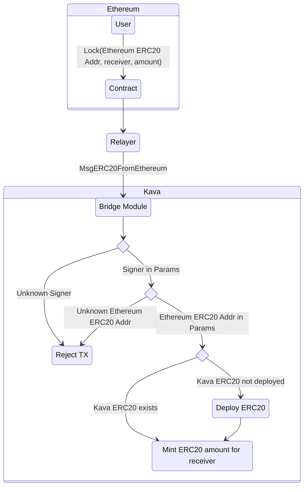

# Concepts

The bridge module deploys ERC20 contracts and mints ERC20 tokens on the Kava EVM
for cross-chain ERC-20 token transfers.

## ERC20

In the following documents, Ethereum ERC20 will refer to an ERC20 token deployed
on the Ethereum network. Kava ERC20 will refer to an ERC20 token deployed on the
Kava EVM.

## Requirements

Bridge Contract

* The bridge contract must be deployed on Ethereum.

Signer

* There must be trusted a signer that watches the bridge smart contract on
  Ethereum for locked asset events. This is a single signer for now.

## Ethereum ERC20 to Kava Transfers

Before being able to bridge Ethereum ERC20 tokens, they need to be added to the
enabled ERC20 tokens in params.

In order to bridge an approved Ethereum ERC20 tokens to Kava, the following
steps are taken:

1. User locks ERC20 tokens in the bridge contract on Ethereum. This emits an
   event with the Ethereum ERC20 address, Ethereum sender address, receiver
   Kava address, amount, and sequence.
2. After a reasonable number of confirmations, the relayer will sign and submit
   a `MsgERC20FromEthereum` message to the Kava chain.
3. The bridge module will verify the message for the following conditions. If
   any of these are false, the transaction will be rejected.
   * The signer address of the message matches the one set in params.
   * The Ethereum ERC20 token is contained in the enabled list set in params.
4. The target Kava ERC20 address is fetched in the module state. If it doesn't
   exist in state, i.e. the Kava ERC20 contract does not exist, it is deployed.
5. The bridge module mints Kava ERC20 tokens for the destination Kava address.

