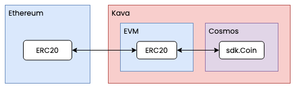

# `bridge`

## Abstract

The `x/bridge` module handles cross-chain transfers of ERC-20 tokens between
external blockchains (Ethereum) and Kava's EVM, and bidirectional internal
bridge to convert between ERC20 tokens on Kava EVM and Kava Cosmos `sdk.Coin`.

This allows the following:

* Transfer between Ethereum ERC20 <-> Kava EVM ERC20. E.g. transferring WETH or
  USDC to Kava EVM.
* Transfer between Kava EVM ERC20 <-> Kava Cosmos `sdk.Coin`. E.g. converting
  ERC20 WETH on Kava EVM to Cosmos `sdk.Coin` to be able to use WETH in Kava
  DeFi modules such as Mint, Lend, Swap, etc.

There is currently no direct path from Ethereum ERC20 to Kava Cosmos `sdk.Coin`,
to get an ERC20 token on Ethereum into the Kava Cosmos ecosystem, tokens must
be bridged to the Kava EVM first, then converted to an `sdk.Coin`.

## Contents

1. **[Concepts](01_concepts.md)**
2. **[State](02_state.md)**
3. **[Messages](03_messages.md)**
4. **[Events](04_events.md)**
5. **[Params](05_params.md)**
